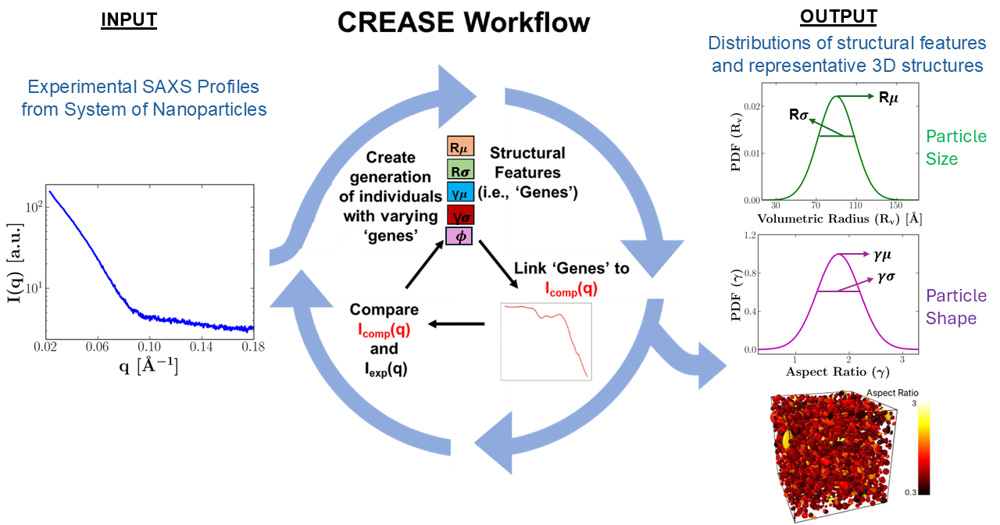

Quantifying Dispersity in Size and Shapes of Nanoparticles from Small-Angle Scattering Data using Machine Learning based CREASE
=======================================================================================================================================

Brief Description  
----------------------------------------------------------

This repository contains Python scripts for the implementation of the CREASE genetic algorithm (CREASE-GA) to quantify the dispersity in both size and shapes of nanoparticles using their azimuthally averaged (1D) scattering profiles. The machine learning based CREASE method has the capability to identify the size and shape distributions of nanoparticles even from featureless 1D scattering profiles which have traditionally posed a challenge for analysis with analytical models. The implementation of these Python scripts are explained in detail as a case study on the [CREASE website](https://crease-ga.readthedocs.io/en/latest/casestudy1.html). The previous implementations of CREASE-GA (2019-2023) for analyzing 1D scattering profiles can be found on the [crease_ga](https://github.com/arthijayaraman-lab/crease_ga) Github page. To interpret the structural information of soft materials from their 2D scattering profiles visit the [CREASE-2D](https://github.com/arthijayaraman-lab/CREASE-2D) Github page.   

A brief description of all the codes included in this repository is provided below.

Quantifying Size Dispersity in Spherical Nanoparticles
----------------------------------------------------------

**Spheres_Size_Dispersity/xgboost_training.py** This Python script contains the Bayseian optimization and training of the XGBoost machine learning (ML) model for the case of spherical nanoparticles with dispersity only in particle size.

**Spheres_Size_Dispersity/crease1d_ga_script.py** This Python script contains the implementation of CREASE-GA for identifying size distributions (output) of spherical nanoparticles using their 1D experimental scattering profile (input). The GA ranks multiple candidate solutions ('GA individuals') based on how closely their computed scattering profiles (obtained using the trained XGBoost ML model) match the input experimental profile.

Quantifying Size and Shape Dispersity in Spherical and Ellipsoidal Nanoparticles
-----------------------------------------------------------------------------------

**Ellipsoids_Spheres_Size_Shape_Dispersity/xgboost_training.py** This Python script contains the Bayseian optimization and training of the XGBoost machine learning (ML) model for the case of spherical and ellipsoidal nanoparticles with dispersity in particle sizes and shapes.

**Ellipsoids_Spheres_Size_Dispersity/crease1d_ga_script.py** This Python script contains the implementation of CREASE-GA for identifying size and shape distributions (output) of spherical and ellipsoidal nanoparticles using their 1D experimental scattering profile (input). The GA ranks multiple candidate solutions ('GA individuals') based on how closely their computed scattering profiles (obtained using the trained XGBoost ML model) match the input experimental profile.
